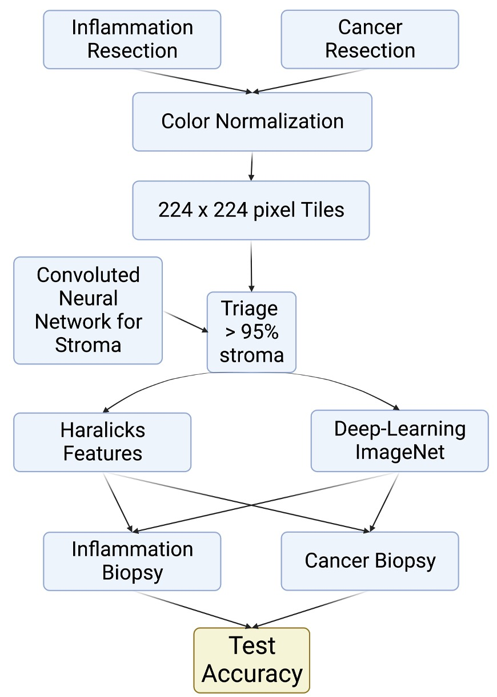
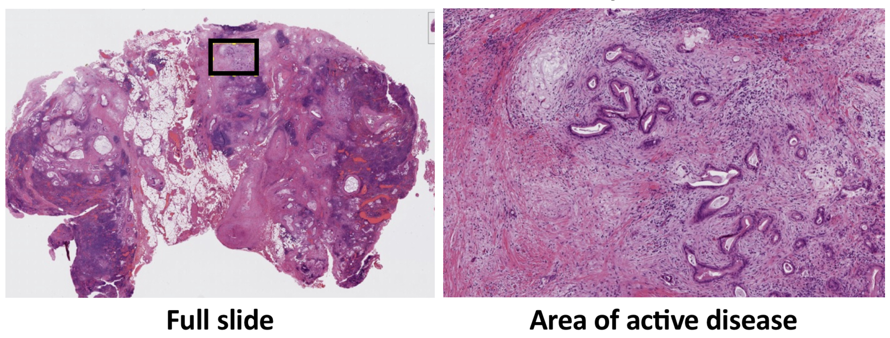
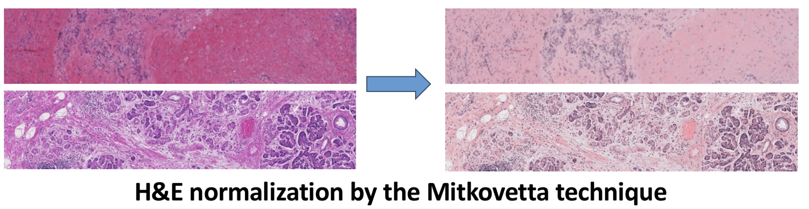
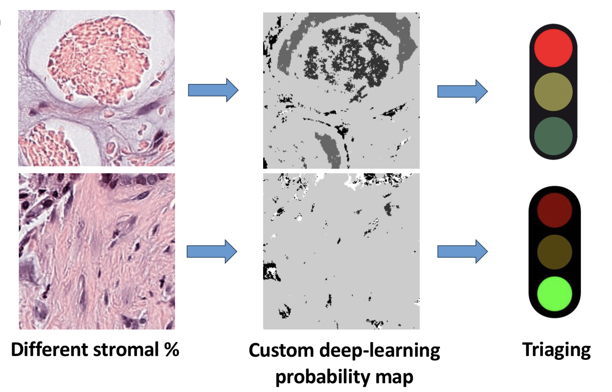
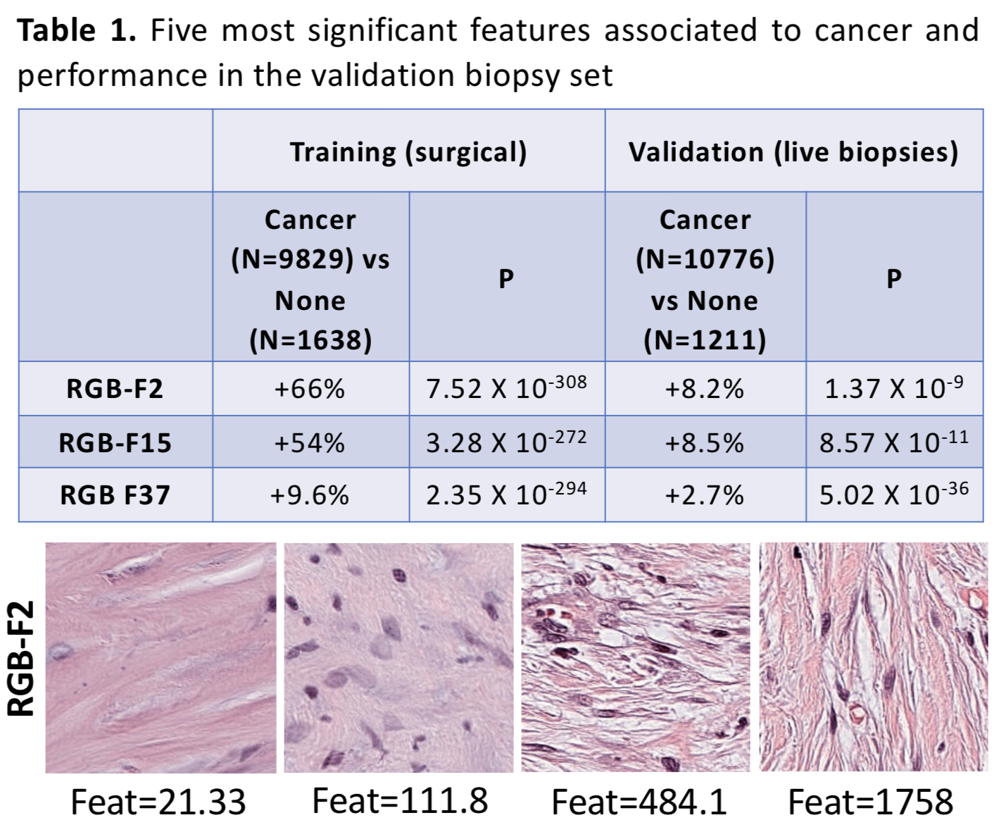

# Deep Learning-based Identification and Characterization of Stroma in Pancreatic Cancer Histology Slides: Implications for Cancer Prevention and Prognosis

Paper link : TBD

This is the official repository with the code and resources for our research project on deep learning-based identification and characterization of stroma in pancreatic cancer histology slides. 

We dedicate to the open-source concept and wish the schoolers can be benefited from our release.

The trained models and the dataset are not available publicly due to the requirement of Centre Hospitalier de l'Université de Montréal (CHUM).

## Table of Contents

- [Introduction](#introduction)
- [Project Structure](#project-structure)
- [Dependencies](#dependencies)
- [Usage](#usage)
- [Experimental Results](#experimental-results)
- [Contributing](#contributing)
- [License](#license)

## Introduction

Pancreatic ductal adenocarcinoma is a deadly disease, and the identification and characterization of stromal regions within histology slides are crucial for understanding cancer progression and developing effective prevention and treatment strategies. Indeed, the stroma comprises up to 90% of pancreatic cancer specimens. The stromal microenvironment interacts with the tumor and remodels itself into a pro-survival niche. This represents a clinical challenge, as biopsies often miss cancer by only sampling stroma. However, biological cues can be inferred from the stroma due to the crosstalk. We aim to deploy image-based artificial intelligence to decipher these stromal cues. In this project, we utilize deep learning techniques to automate the identification and characterization of stroma in pancreatic cancer histology slides.

## Project Structure

- `Annotation_and_Exportation_in_ometiff`: Tools for annotating histology slides' regions of interest and exporting in OME-TIFF format from QuPath.
- `Image_registration`: Code for image registration techniques used in our research.
- `H&E_color_normalization`: Implementation of H&E color normalization for pathology slides.
- `Tiling`: Scripts for tiling histology slides using QuPath.
- `Renaming_Tiles`: Renaming files into shorter and more intuitive names for easier processing
- `Ilastik_trainer`: Deep-learning stromal segmenter.
- `Triaging_from_Ilastik_training`: Code for triaging tiles with >85% stroma from Ilastik training.
- `VGG16_Training`: Training of the VGG16 deep learning model.
- `VGG16_Process`: Implementation of the VGG16 deep learning model.
- `Haralicks`: Code for extracting Haralick texture features from

## Dependencies

To run the code in this project and replicate our experiments, you will need to install the following dependencies:

- [Python](https://www.python.org/downloads/): We used Python 3.7 for this project.
- [NumPy](https://numpy.org/): A library for numerical computing.
- [Pandas](https://pandas.pydata.org/): A data manipulation and analysis library.
- [TensorFlow](https://www.tensorflow.org/): An open-source machine learning framework.
- [Scikit-learn](https://scikit-learn.org/stable/): A machine learning library for data mining and analysis.
- [Matplotlib](https://matplotlib.org/): A plotting library for creating visualizations.
- [OpenCV](https://opencv.org/): An open-source computer vision library.
- [QuPath](https://qupath.github.io/): A bioimage analysis software used for pathology image analysis.
- [Ilastik](https://www.ilastik.org/): An interactive learning and segmentation toolkit.

### Installation

You can install the required Python packages using [pip](https://pip.pypa.io/en/stable/). Use the following command to install them:
pip install -r requirements.txt

## Optional Dependencies

Depending on your specific research needs, you may also consider the following optional libraries and tools:

- **[PyTorch](https://pytorch.org/):** An alternative deep learning framework to TensorFlow.
- **[Keras](https://keras.io/):** A high-level deep learning library that can work with TensorFlow, Theano, or CNTK.
- **[OpenSlide](https://openslide.org/):** A library for reading and managing whole-slide images (WSIs).
- **[Jupyter Notebooks](https://jupyter.org/):** For creating interactive research notebooks.
- **[Scipy](https://www.scipy.org/):** A library with additional scientific and statistical functions.
- **[Scikit-image](https://scikit-image.org/):** For image processing tasks.
- **[Bioconductor](https://bioconductor.org/):** R-based packages for genomics analysis.
- **[Dask](https://dask.org/):** For distributed and parallel computing tasks.

## Usage

## Experimental Results 

Intermediate Features of the computer vision and deep-learning steps. 
Example of whole slide images, with annotated area of study.

Normalization of two differentially stained tiles. 

Segmentation and selection of high-stroma tiles to be fed into the training datasets.

Contrastive learning of most significant features highlights a clear difference in the appearance of the extracellular matrix and the degree of fibroblast activation.

## Contributing 

## License

This project is licensed under the MIT License. See the [LICENSE](LICENSE) file for details.

### MIT License

MIT License

Copyright (c) [2023] [Melisa Farias Gonzalez] [Zean Ghanmeh]

Permission is hereby granted, free of charge, to any person obtaining a copy
of this software and associated documentation files (the "Software"), to deal
in the Software without restriction, including without limitation the rights
to use, copy, modify, merge, publish, distribute, sublicense, and/or sell
copies of the Software, and to permit persons to whom the Software is
furnished to do so, subject to the following conditions:

The above copyright notice and this permission notice shall be included in all
copies or substantial portions of the Software.

THE SOFTWARE IS PROVIDED "AS IS", WITHOUT WARRANTY OF ANY KIND, EXPRESS OR
IMPLIED, INCLUDING BUT NOT LIMITED TO THE WARRANTIES OF MERCHANTABILITY,
FITNESS FOR A PARTICULAR PURPOSE AND NONINFRINGEMENT. IN NO EVENT SHALL THE
AUTHORS OR COPYRIGHT HOLDERS BE LIABLE FOR ANY CLAIM, DAMAGES OR OTHER
LIABILITY, WHETHER IN AN ACTION OF CONTRACT, TORT OR OTHERWISE, ARISING FROM,
OUT OF OR IN CONNECTION WITH THE SOFTWARE OR THE USE OR OTHER DEALINGS IN THE
SOFTWARE.

